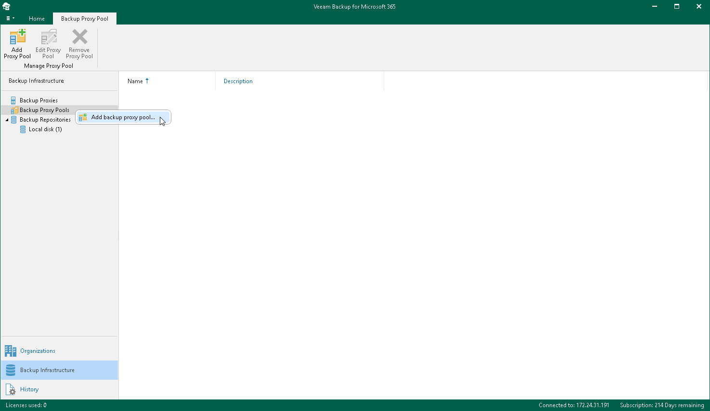

# Step 1. Launch New Backup Proxy Pool Wizard

To launch the New Backup Proxy Pool wizard, do the following:

1. Open the Backup Infrastructure view.
2. In the inventory pane, select the Backup Proxy Pools node.
3. Do one of the following:

* On the Backup Proxy Pool tab, click Add Proxy Pool on the ribbon.
* Right-click the Backup Proxy Pools node and select Add backup proxy pool.

