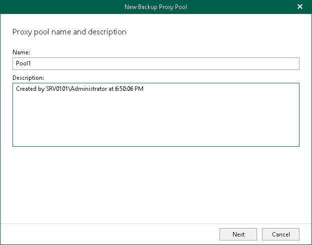

# Step 2. Specify Backup Proxy Pool Name

At this step of the wizard, enter a name for the backup proxy pool and provide optional description:

1. In the Name field, enter a name for the backup proxy pool.
2. In the Description field, enter optional description.

