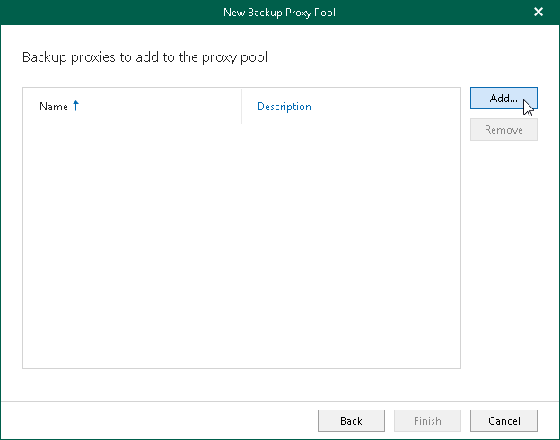
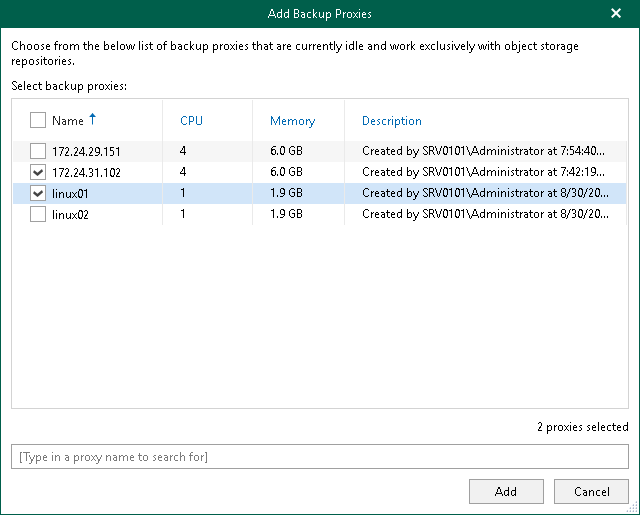
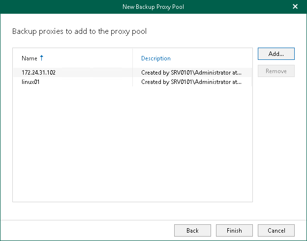

In this article

At this step of the wizard, select backup proxy servers that you want to add to the backup proxy pool.

To select backup proxy servers, do the following:

1. Click Add.

1. In the Add Backup Proxies window, select check boxes next to the backup proxy servers that you want to add to the backup proxy pool.

|  |
| --- |
| Tip |
| To quickly find necessary backup proxy servers, you can use the search field at the bottom. |

1. Click Add.

The selected backup proxy servers appear in the list of backup proxy servers added to the backup proxy pool.

Page updated 8/30/2024

Page content applies to build 8.3.0.2201
