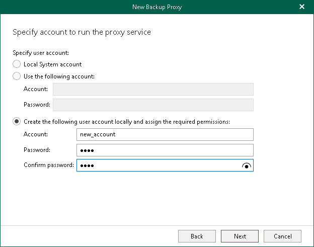

In this article

At this step of the wizard, specify an account that will be used to run Veeam Backup for Microsoft 365 Proxy Service on the [specified computer](vbo_proxy_server_address.md).

To do this, select one of the following options:

* Local System account. Select this option to use Local System account as the service account.
* Use the following account. Select this option to use an account that already exists and specify the account credentials in the Account and Password fields.

You must manually grant this account the [required permissions](permissions_windows.md) in advance.

|  |
| --- |
| Note |
| If you have selected the Use domain network check box at the [Specify Backup Proxy Server Address](vbo_proxy_server_address.md) step of the wizard, the account must not be a non-domain local service account. |

* Create the following user account locally and assign the required permissions. Select this option to create a new account that Veeam Backup for Microsoft 365 will use as the service account. Specify credentials for the account that you want to create in the Account and Password fields. Confirm the password in the Confirm password field.

Veeam Backup for Microsoft 365 will create a new service account and automatically grant the [required permissions](permissions_windows.md) to this account.

|  |
| --- |
| Note |
| The user name of the custom account must be specified in the following format: domain\account. |

Page updated 9/16/2024

Page content applies to build 8.3.0.2201
