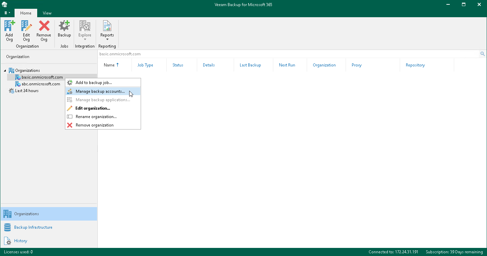
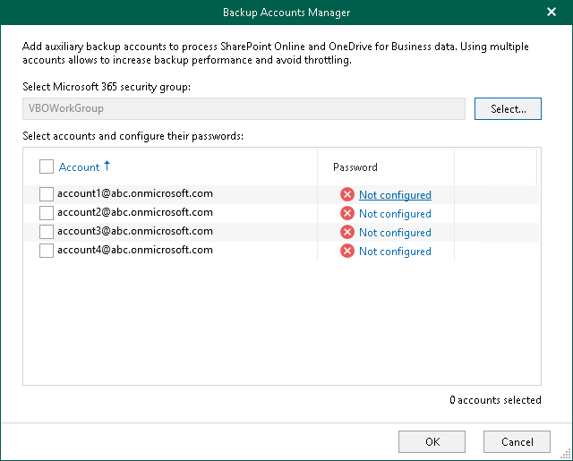
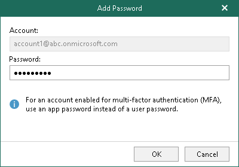

In this article

For Microsoft 365 organizations added using either basic authentication or modern authentication method with legacy protocols allowed, you can configure auxiliary backup accounts.

To add auxiliary backup accounts to the backup configuration, do the following:

1. Open the Organizations view.
2. In the inventory pane, right-click an organization and select Manage backup accounts.

Keep in mind that the Manage backup accounts option is unavailable for organizations with modern app-only authentication. For organizations added using modern app-only authentication, you use the Manage backup applications option. For more information, see [Adding Applications](adding_backup_applications.md).

1. In the Backup Accounts Manager window, click Select.
2. In the Select Security Group window, select a security group with accounts that you want to use as auxiliary backup accounts and click Add.

Consider the following:

* The entire security group will be granted the Site Collection Administrator role. If a user ceases to be a member of the selected group, the role is automatically revoked for this user.
* You should not select the All Users security group. Instead, you can create a new security group and populate this group with user accounts that you want to use during a backup session of Microsoft SharePoint data. For more information on how to create a new security group, see [this Microsoft article](https://docs.microsoft.com/en-us/microsoft-365/admin/email/create-edit-or-delete-a-security-group?view=o365-worldwide).
* Mail-enabled security groups are not supported.
* Veeam Backup for Microsoft 365 does not use an account under which you add your Microsoft 365 organization.

1. In the Select accounts and configure their passwords list, select check boxes next to accounts that you want to add as backup accounts.
2. In the Password column, click Not configured.

1. In the Add Password window, enter the password for the account and click OK.

Make sure to specify an [Microsoft Entra application](https://docs.microsoft.com/en-us/azure/active-directory/develop/active-directory-how-applications-are-added) password instead of a user account password when adding MFA-enabled accounts.

Page updated 8/23/2024

Page content applies to build 8.3.0.2201
