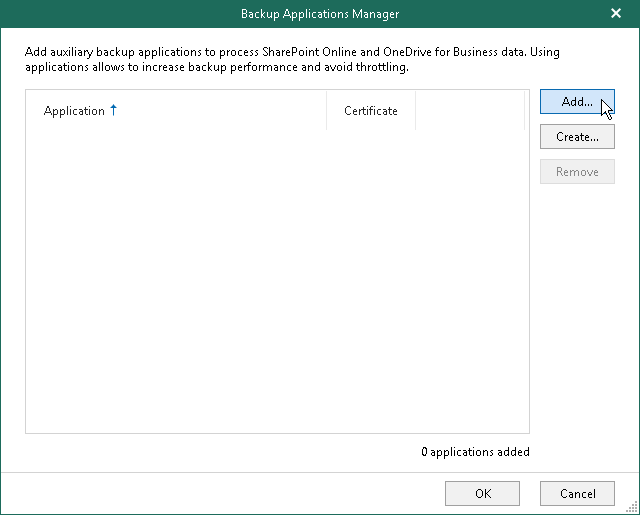
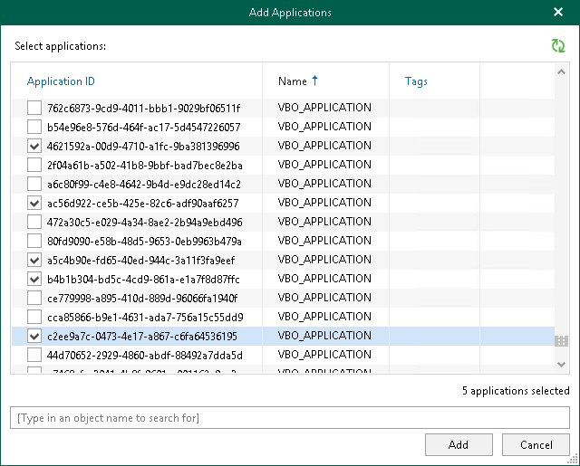
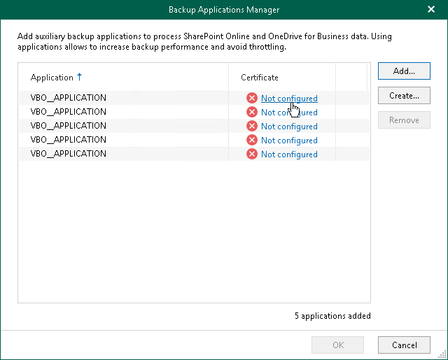

# Adding Applications

When you add Microsoft Entra applications to the backup configuration, Veeam Backup for Microsoft 365 retrieves a list of existing applications from your Microsoft Entra ID. From this list, you can select as many applications as you need. For more information about Microsoft Entra applications, see [this Microsoft article](https://docs.microsoft.com/en-us/azure/active-directory/develop/active-directory-how-applications-are-added).

To add Microsoft Entra applications to the backup configuration, do the following:

1. Open the Organizations view.
2. In the inventory pane, right-click a Microsoft 365 organization with modern app-only authentication and select Manage backup applications.

Keep in mind that the Manage backup applications option is available only for organizations added using modern app-only authentication. For organizations added using either basic authentication or modern authentication method with legacy protocols allowed, you use the Manage backup accounts option. For more information, see [Adding Accounts](adding_backup_accounts.md).

1. In the Backup Applications Manager window, click Add.

1. In the Add Applications window, select Microsoft Entra applications that you want to add and click Add.

Make sure to manually grant the [required permissions](backup_app_permissions.md) to Microsoft Entra applications in advance.

Also, keep in mind that Veeam Backup for Microsoft 365 ignores a Microsoft Entra application that you use when [adding](adding_o365_organizations_sd.md) your Microsoft 365 organization.

1. Click Not configured next to each added application to configure an SSL certificate that you want to use for secure communications between Veeam Backup for Microsoft 365 and your Microsoft Entra application.

1. In the Select Certificate wizard, proceed to any of the following options:

* [Select certificate from the Certificate Store of this server](vbo_installing_certificate.md#selecting_file)
* [Import certificate from a PFX file](vbo_installing_certificate.md#import)

Before selecting a certificate in Veeam Backup for Microsoft 365, you must upload a certificate file to Microsoft Identity platform. For more information, see [this Microsoft article](https://docs.microsoft.com/en-us/azure/active-directory/develop/howto-create-service-principal-portal#certificates-and-secrets).

