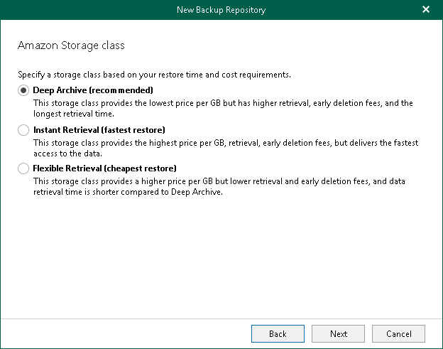

In this article

This step is only available if you have selected the Amazon S3 Glacier option at the [Select Amazon Storage Type and Account](amazon_storage_class.md) step of the wizard.

At this step of the wizard, select one of the following options:

* Deep Archive. Select this option if you plan to access your data in backup copies rarely. Veeam Backup for Microsoft 365 will mark each block as Amazon S3 Glacier Deep Archive.
* Instant Retrieval. Select this option if you plan to access your data in backup copies regularly and retrieve data in milliseconds. Veeam Backup for Microsoft 365 will mark each block as Amazon S3 Glacier Instant Retrieval.
* Flexible Retrieval. Select this option if you plan to access your data in backup copies 1–2 times per year and retrieve it asynchronously. Veeam Backup for Microsoft 365 will mark each block as Amazon S3 Glacier Flexible Retrieval.

Page updated 7/18/2024

Page content applies to build 8.3.0.2201
