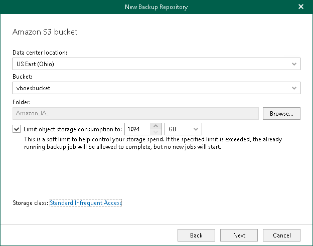

In this article

At this step of the wizard, select a location of your Amazon bucket, a bucket and folder where you want to save your data. For the Amazon S3 storage type, you can also specify Amazon S3 storage class. For more information, see [Supported Amazon S3 Storage Classes](supported_storage_classes_amazon.md).

1. From the Data center location drop-down list, select a region that contains available buckets.
2. From the Bucket drop-down list, select a bucket.

Make sure that the bucket you want to use to store your data was created in advance; Veeam Backup for Microsoft 365 does not support creating new buckets.

1. In the Folder field, select a cloud folder to which you want to map your object storage repository, and which will be used to store backups.

To select a folder, click Browse and either select an existing folder or create a new one by clicking New Folder.

For more information on how data is stored, see [Object Storage Repository Structure](object_storage_structure.md).

1. Select the Limit object storage consumption to check box and specify the limit value in GB, TB or PB.

If you select this check box, Veeam Backup for Microsoft 365 limits capacity of the object storage repository and prohibits running new jobs when the specified value is exceeded.

1. If you have selected the Amazon S3 option at the [previous](amazon_storage_class.md) step, click the Storage class link. The Standard value is specified by default.
2. In the Storage Class Settings window, do the following:

* Standard. Select this option if you plan to create a general-purpose storage of frequently accessed data. This option is selected by default.
* Standard Infrequent Access. Select this option if you plan to access your backup data in an infrequent manner.
* One Zone-Infrequent Access. Select this option to store backups in the same geographic zone within the datacenter.

For more information about infrequent access, see [this Amazon article](https://aws.amazon.com/s3/storage-classes/#Infrequent_access).

Page updated 8/30/2024

Page content applies to build 8.3.0.2201
