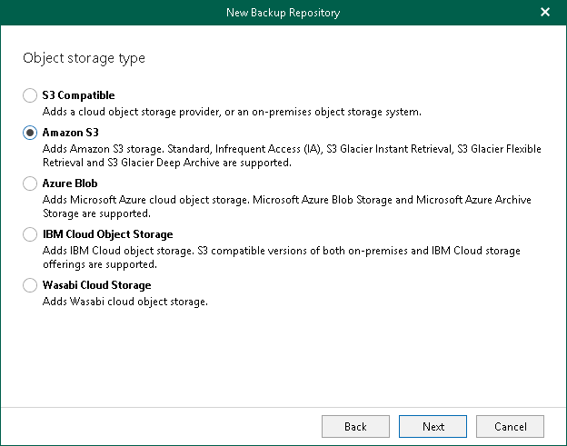

# Step 4. Select Object Storage Type

At this step of the wizard, select Amazon S3.

For more information about supported Amazon S3 storage classes, see [Supported Amazon S3 Storage Classes](supported_storage_classes_amazon.md).

