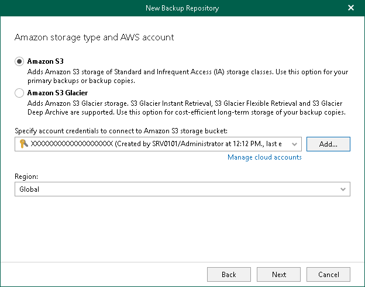

# Step 5. Select Amazon Storage Type and Account

At this step of the wizard, select a type of Amazon storage, specify an Amazon account and select a datacenter region.

1. Select one of the following options:

* Amazon S3. Select this option if you want to add Amazon S3 Standard, Amazon S3 Standard-Infrequent Access and Amazon S3 One Zone-Infrequent Access storage classes. You can use these storage classes as a target for both backup and backup copy jobs.
* Amazon S3 Glacier. Select this option if you want to use this object storage repository only to store backup copies and select it as a target for backup copy jobs. Veeam Backup for Microsoft 365 supports Amazon S3 Glacier Instant Retrieval, Amazon S3 Glacier Flexible Retrieval and Amazon S3 Glacier Deep Archive storage classes for this purpose.

For more information about supported Amazon S3 storage classes, see [Supported Amazon S3 Storage Classes](supported_storage_classes_amazon.md).

1. From the Specify account credentials to connect to Amazon S3 storage bucket drop-down list, select user credentials to access your Amazon S3 object storage.

If you already have a credentials record that was configured beforehand, select such a record from the drop-down list. Otherwise, click Add and provide your access and secret keys. For more information, see [Adding Amazon AWS Access Key](aws_access_key.md). You can also click Manage cloud accounts to [manage existing credentials records](edit_remove_cloud_creds.md).

1. From the Region drop-down list, select a datacenter region.

