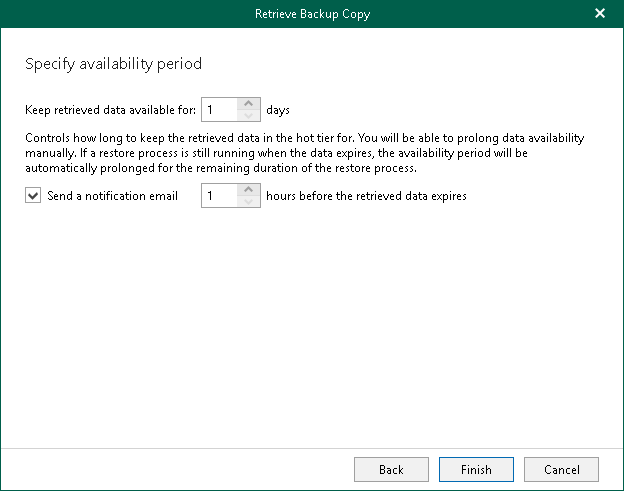

# Step 7. Specify Availability Period

At this step of the wizard, specify the availability period that you want to apply for the retrieved backed-up data. During this period you will be able to explore and restore your data using Veeam Explorers. For more information, see [Exploring Retrieved Data](vbo_exploring_retrieved.md).

If you want to receive a notification that the availability period is about to end, select the Send a notification email N hours before the retrieved data expires check box and specify the time for the notification.

|  |
| --- |
| Note |
| You can extend the availability period if necessary. For more information, see [Editing Retrieval Job Settings](editing_retrieval_job_settings.md) and [Extending Availability of Retrieved Data](vbo_extending_availability.md). |

