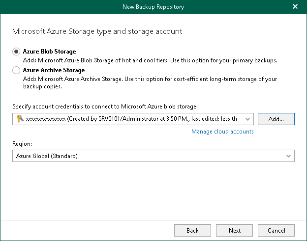

In this article

At this step of the wizard, select a type of Azure Blob storage, specify a Microsoft Azure storage account and select a region.

1. Select one of the following options:

* Azure Blob Storage. Select this option if you want to use this object storage repository as a target for both backup and backup copy jobs.
* Azure Archive Storage. Select this option if you want to use this object storage repository only to store backup copies and select it as a target for backup copy jobs. Veeam Backup for Microsoft 365 supports Azure Blob Storage Archive access tier for this purpose.

For more information about supported Azure storage account types and supported access tiers for Azure Blob Storage, see [Supported Azure Storage Account Types](supported_storage_account_types.md).

1. From the Specify account credentials to connect to Microsoft Azure blob storage drop-down list, select user credentials to access your Azure Blob storage.

If you already have a credentials record that was configured beforehand, select such a record from the drop-down list. Otherwise, click Add and provide your account and a shared key. For more information, see [Adding Microsoft Azure Blob Storage Account](azure_storage_account.md). You can also click Manage cloud accounts to [manage existing credentials records](edit_remove_cloud_creds.md).

1. From the Region drop-down list, select a Microsoft Entra region.

Page updated 8/26/2024

Page content applies to build 8.3.0.2201
