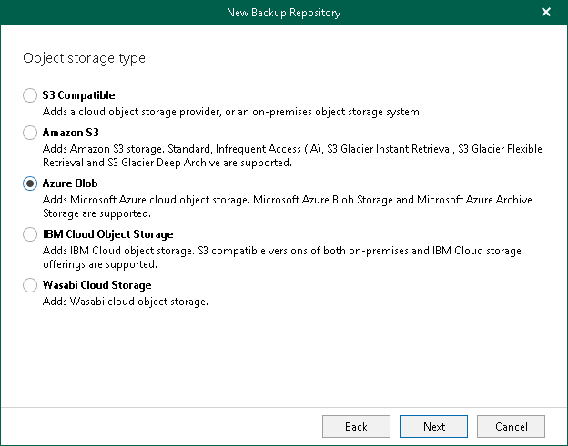

# Step 4. Select Object Storage Type

At this step of the wizard, select Azure Blob.

For more information about supported Azure storage account types and supported access tiers for Azure Blob Storage, see [Supported Azure Storage Account Types](supported_storage_account_types.md).

