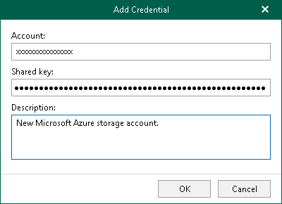

In this article

You can add new credentials for [Microsoft Azure Blob storage](adding_azure_storage.md).

To add credentials, do the following:

1. In the main menu, click Credentials & Passwords > Manage Cloud Credentials.
2. In the Cloud Credential Manager window, click Add > Microsoft Azure storage account.
3. In the Account field, enter your storage account name.
4. In the Shared key field, enter your shared key.
5. In the Description field, enter optional description.
6. Click OK.

Related Topics

* [Adding Microsoft Azure Blob Storage](adding_azure_storage.md)
* [Editing and Removing Cloud Credentials](edit_remove_cloud_creds.md)

Page updated 10/13/2025

Page content applies to build 8.3.0.2201
