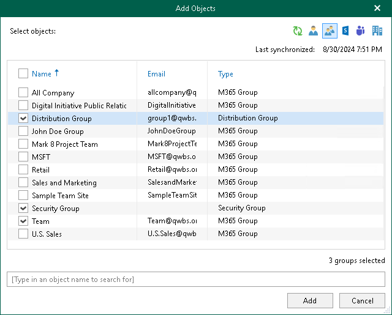
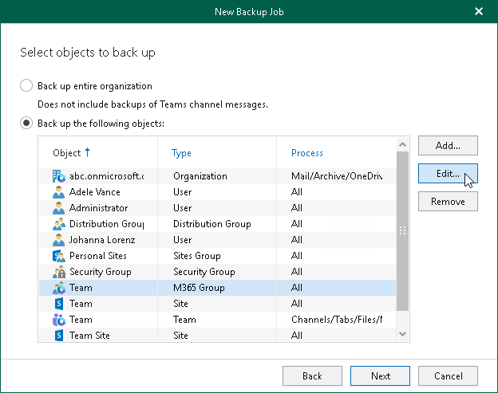
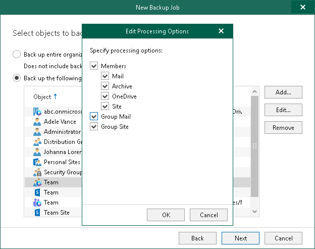

In this article

|  |
| --- |
| Tip |
| Consider the following:   * To switch between objects of different types, you can click the buttons in the upper-right corner.  * To refresh the objects list, you can click Refresh.  * To quickly find necessary objects, you can use the search field at the bottom. |

To configure Groups backup, do the following:

1. In the Add Objects window, select check boxes next to the groups that you want to back up.

1. Click Add.

The selected objects appear in the list of objects to back up.

1. If you want to specify processing options, select the necessary Group type object and click Edit.

1. In the Edit Processing Options window, select check boxes next to the processing options that you want to apply, and click OK.

For more information about available Group types and their processing options, see [Organization Object Types](vbo_object_types.md#groups).

Page updated 10/7/2025

Page content applies to build 8.3.0.2201
