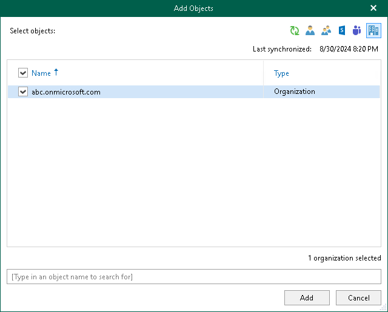
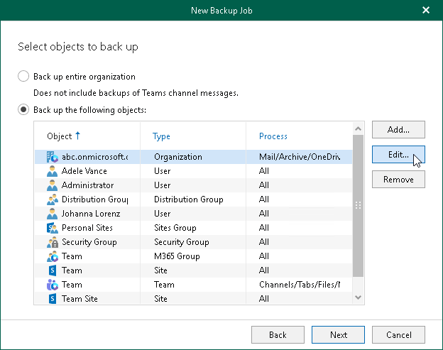
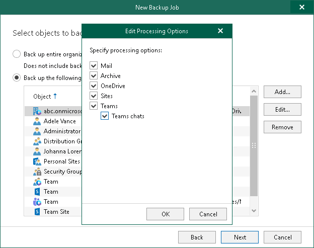

# Configuring Organization Backup

|  |
| --- |
| Tip |
| Consider the following:   * To switch between objects of different types, you can click the buttons in the upper-right corner.  * To refresh the objects list, you can click Refresh.  * To quickly find necessary objects, you can use the search field at the bottom. |

To configure Organization backup, do the following:

1. In the Add Objects window, select check boxes next to the organizations that you want to back up.

1. Click Add.

The selected objects appear in the list of objects to back up.

1. If you want to specify processing options, select the necessary Organization type object and click Edit.

1. In the Edit Processing Options window, select check boxes next to the processing options that you want to apply, and click OK.

For more information about the Organization type and its processing options, see [Organization Object Types](vbo_object_types.md#organizations).

Keep in mind that the Teams chats check box is displayed and is available for editing only if you have selected the Teams chats check box when you added a Microsoft 365 organization to Veeam Backup for Microsoft 365.

