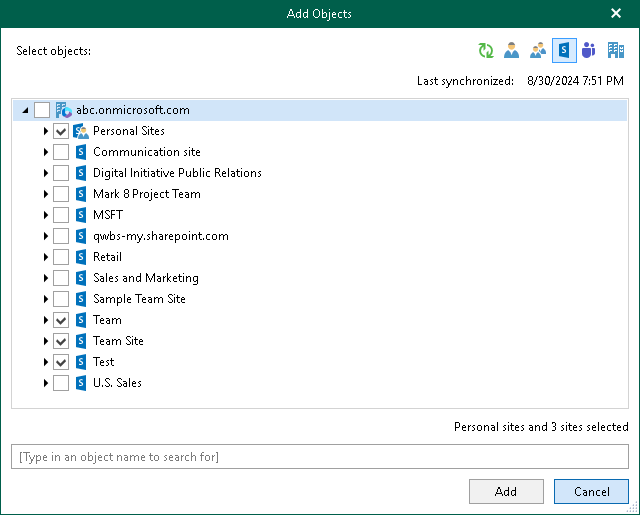

In this article

|  |
| --- |
| Tip |
| Consider the following:   * To switch between objects of different types, you can click the buttons in the upper-right corner.  * To refresh the objects list, you can click Refresh.  * To quickly find necessary objects, you can use the search field at the bottom. Search is available only for personal sites and subsites displayed in the objects tree. |

To configure Sites backup, do the following:

1. In the Add Objects window, select check boxes next to the sites or subsites that you want to back up.

Keep in mind that you need to expand the Personal Sites node or a node of a parent site to view all personal sites or subsites.

1. Click Add.

The selected objects appear in the list of objects to back up.

Keep in mind that you cannot edit processing options for the Site type objects. For more information about the Site type, see [Organization Object Types](vbo_object_types.md#sites).

Page updated 8/30/2024

Page content applies to build 8.3.0.2201
