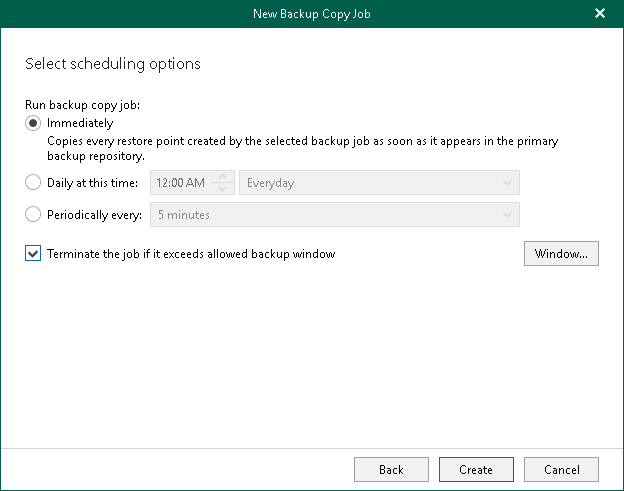
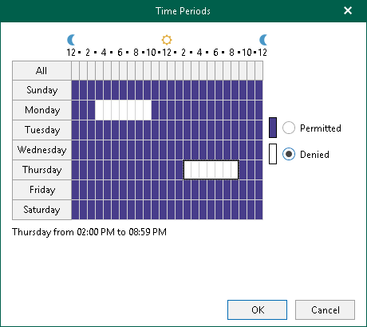

In this article

At this step of the wizard, configure a schedule for your backup copy job.

To configure a schedule, do the following:

1. In the Run backup copy job section, select one of the following options:

* Immediately. Select this option if you want to run the backup copy job right after the latest restore point appears in the source backup repository. During the first run of the backup copy job, Veeam Backup for Microsoft 365 copies the latest restore point created by the source backup job (backup job for which you create a backup copy job). During next runs — each subsequent restore point.
* Daily at this time. Select this option if you want to run the backup copy job on the specified days at the specified hours.

|  |
| --- |
| Note |
| When you configure the job schedule, keep in mind possible date and time changes (for example, related to daylight saving time transition). |

* Periodically every. Select this option if you want to run the backup copy job every N minutes or hours.

Keep in mind that if you run your backup copy job daily or periodically, Veeam Backup for Microsoft 365 copies only the latest restore point that appeared in the source object storage repository since the last run of this backup copy job.

1. Select the Terminate the job if it exceeds allowed backup window check box, click Window and specify allowed and prohibited hours for the backup copy job. For more information, see [Selecting Time Periods](#stp).

Selecting Time Periods

When you click Window, the Time Periods dialog appears in which you can:

* Set the Permitted execution time frame for the backup copy job.
* Set the Denied execution time frame for the backup copy job.

The main area of the dialog is divided into two axes:

* The vertical axis represents days of the week from Sunday to Saturday.
* The horizontal axis represents time intervals from 12 AM to 11:59 PM.

Within these axes a matrix is placed consisting of blocks. Each block represents a 59 minutes interval for each day of the week. The total number of blocks is 168 (24 blocks per each day of the week).

To set up an execution frame for the backup copy job, do the following:

1. Select a block that corresponds to the day of the week (vertical axis) and to the time interval (horizontal axis) on which you want to allow or prohibit the execution of a backup copy job.

In addition, you can:

1. Select multiple blocks simultaneously by clicking and holding the mouse pointer on the first block and dragging it until the last one that you want to use, including different days of the week.
2. Click a day of the week in the vertical axis to select all the blocks of the day.
3. Click All in the vertical axis to select all the blocks of the entire week.

1. On the right-hand side, select either the Permitted or Denied option to set up the execution rule for the selected blocks.

The following is an example in which it is prohibited to run a backup copy job on the following days of the week:

* Monday from 03:00 AM up until 09:59 AM.
* Thursday from 02:00 PM up until 08:59 PM.

Page updated 7/7/2025

Page content applies to build 8.3.0.2201
