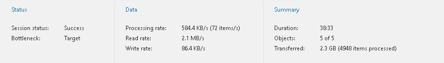

# Viewing Backup and Backup Copy Session Metrics

You can view a backup and backup copy session metrics in one of the following ways:

* Open the Organizations view and in the inventory pane, select an organization and then select a backup or backup copy job in the preview pane.
* Open the History view and in the inventory pane, select the Jobs > Backup or Jobs > Copy node and then select a backup or backup copy session in the preview pane.

Metrics of a backup or backup copy session consist of the following sections:

* The Status section that shows the following fields:

* Session status. The current state of the selected session.
* Bottleneck. A bottleneck value.

This value may be: Detecting, Source, Target and N/A.

* The Detecting state is displayed when a backup or backup copy job is started and Veeam Backup for Microsoft 365 has not calculated the bottleneck value.

* The Source state is displayed when a bottleneck occurs during download.

For example, if you have a slow connection or problems occur on the internet provider side and your connection speed drops significantly, the bottleneck value will typically be shown as Source.

* The Target state is displayed when a bottleneck occurs during writing data to disk.

For example, if you are using a hard drive that is fragmented or an old type of the hard drive, the bottleneck value will typically be shown as Target.

* The N/A state is displayed when no bottleneck occurs.

* Last Backup. The date and time of the last backup or backup session.

* The Data section that shows the following fields:

* Processing rate. Shows the processing rate.
* Read rate. Shows the download speed.
* Write rate. Shows the writing speed.

* The Summary section that shows the following fields:

* Duration. The duration of the backup or backup copy session.
* Objects. Shows how many objects have been backed up or copied during the session.

An object is an OneDrive account, SharePoint site, Microsoft Teams team, mailbox and archive mailbox, including group mailboxes, public folders and discovery search mailboxes.

* Transferred. Shows an amount of data transferred from source to target before applying compression and deduplication.

