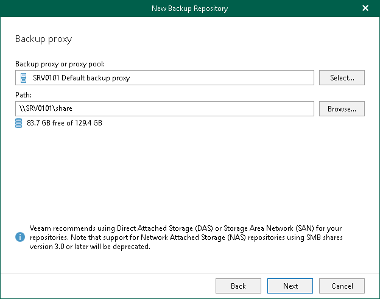

In this article

Veeam Backup for Microsoft 365 allows you to use network attached storage (NAS) as JET-based backup repositories. Such NAS can be a shared folder on your computer, or any other physical device that can be accessed using the Server Message Block (SMB) protocol.

|  |
| --- |
| Note |
| SMB shares support will be dropped in future versions of Veeam Backup for Microsoft 365. |

Consider the following:

* Network share browsing is not supported; make sure to prove the path to the shared folder manually.
* A shared folder must be on a computer or device located within the same or a trusted domain.

* To use SMB 3.0 or later, make sure you are using Microsoft Windows 8 or later or Microsoft Windows Server 2012 or later.
* SMB shares version 3.0 are only supported when they are within the Microsoft Exchange Storage definition. For more information, see [this Microsoft article](https://learn.microsoft.com/en-us/exchange/plan-and-deploy/deployment-ref/storage-configuration?view=exchserver-2019).

To access and use a shared folder, do the following:

* Configure NTFS permissions.
* Configure share permissions.

For more information, see [this Veeam article](https://www.veeam.com/kb2971).

After you share a folder, you can access it using the SMB 3.0 protocol to read/write data to/from this folder.

To add a shared folder as a backup repository, at the [Specify Backup Proxy Server](new_repository_2.md) step, in the Path field, specify the path to the shared folder using the following syntax: \\<FQDN\_name> or <ip\_address>\<shared\_folder\_name>.

Related Topics

[Adding JET-Based Backup Repositories](vbo_adding_repository.md)

Page updated 8/30/2024

Page content applies to build 8.3.0.2201
