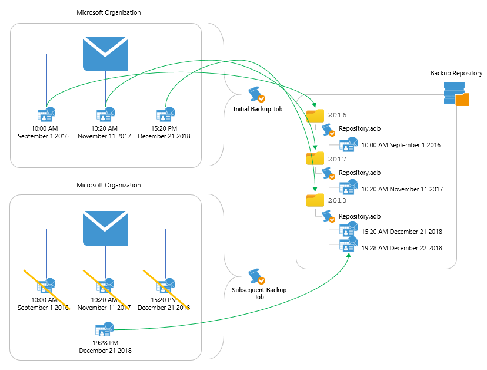

# JET-Based Backup Repository Structure

In a JET-based backup repository, all backed-up items are stored in a way that each item belongs to a separate folder named after the year when the item has been modified.

Each folder contains repository.adb — a backup file with the Microsoft 365 organization data — along with a number of auxiliary files required to retain information about restore points and repository configuration settings. To determine the period during which backup data must be stored in a backup repository, Veeam Backup for Microsoft 365 applies retention policy settings specified while adding the repository.

|  |
| --- |
| Note |
| For each JET-based backup repository, Veeam Backup for Microsoft 365 saves information about restore points to the ESE database file. Veeam Backup for Microsoft 365 collects this information for all backups that are stored in this backup repository and then synchronizes data with the configuration database created on the PostgreSQL instance. |

The following example represents a Microsoft organization with a mailbox that contains 3 email items; each item has been modified on a different date (10:00 AM on 9/1/2016, 10:20 AM on 11/11/2017 and 3:20 PM on 12/21/2018). To protect these items, you configure a backup job that stores backed-up files in a specific JET-based backup repository. When running backup job sessions, Veeam Backup for Microsoft 365 adds items to the backup repository in the following way:

* During the initial backup job session, Veeam Backup for Microsoft 365 collects all data from the Microsoft organization and saves the data to folders in the backup repository.

As each email item has been modified on a different date, Veeam Backup for Microsoft 365 creates 3 different folders in the backup repository: 2016, 2017 and 2018. Each folder contains its own backup file repository.adb.

* During subsequent backup job sessions, Veeam Backup for Microsoft 365 backs up only those email items that were changed since the previous backup job session.

This means that if the organization receives a new email item at 7:28 PM on 12/21/2018, and no other items change since the initial backup job session, Veeam Backup for Microsoft 365 will back up only the new item — and save the data to the repository.adb file in the 2018 repository folder.

|  |
| --- |
| Note |
| Although the example describes only Microsoft Exchange items, the same approach applies to Microsoft SharePoint items, Microsoft OneDrive for Business items and Microsoft Teams items. |

Related Topics

[Retention Policy](retention_policy.md)

