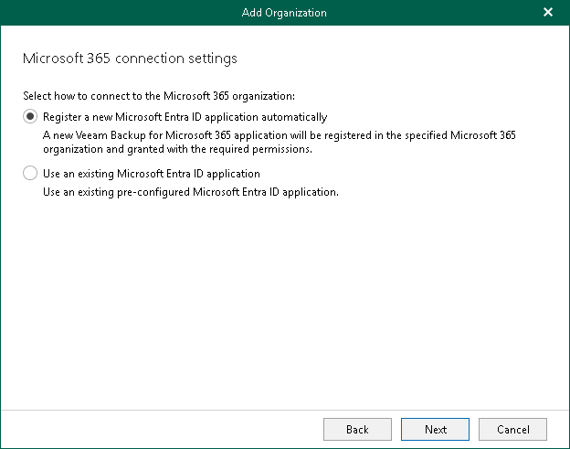
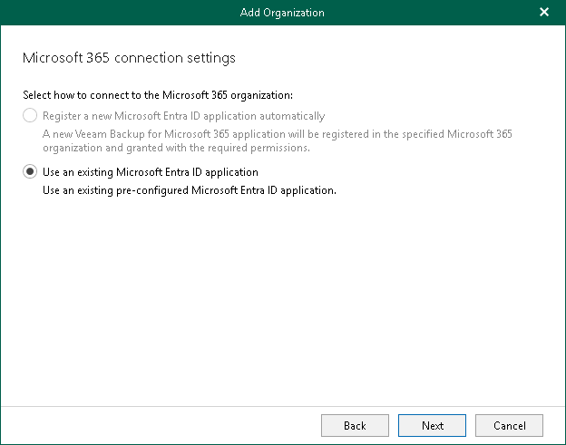

# Step 4. Configure Connection to Microsoft 365

At this step of the wizard, choose whether you want to register a new [Microsoft Entra application](https://docs.microsoft.com/en-us/azure/active-directory/manage-apps/what-is-application-management) to connect to your Microsoft 365 organization or use an existing Microsoft Entra application.

For Microsoft Teams Backup Only

Use this scenario if you have not selected the Teams chats check box at the [Select Organization Deployment Type](vbo_add_o365_sd.md) step of the wizard.

You can select one of the following options:

* Register a new Microsoft Entra ID application automatically

With this option selected, Veeam Backup for Microsoft 365 requires to provide an application name and certificate to register a new Microsoft Entra application in Microsoft Entra ID. For more information, see [Registering New Microsoft Entra Application](register_ad_application.md#cna).

* Use an existing Microsoft Entra ID application

With this option selected, Veeam Backup for Microsoft 365 requires to provide connection parameters to the existing Microsoft Entra application. For more information, see [Using Existing Microsoft Entra Application](register_ad_application.md#uea).

For Microsoft Teams and Team Chats Backup

Use this scenario if you have selected the Teams chats check box at the [Select Organization Deployment Type](vbo_add_o365_sd.md) step of the wizard.

|  |
| --- |
| Note |
| If you want to back up team chats, registering a new Microsoft Entra application is unavailable. |

You can only select the Use an existing Microsoft Entra ID application option. Veeam Backup for Microsoft 365 requires to provide connection parameters to the existing Microsoft Entra application. For more information, see [Using Existing Microsoft Entra Application](register_ad_application.md#uea).

