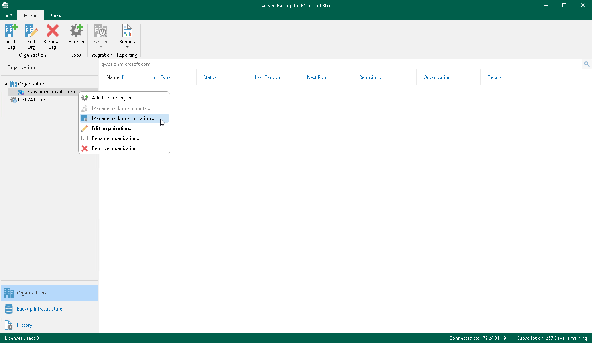
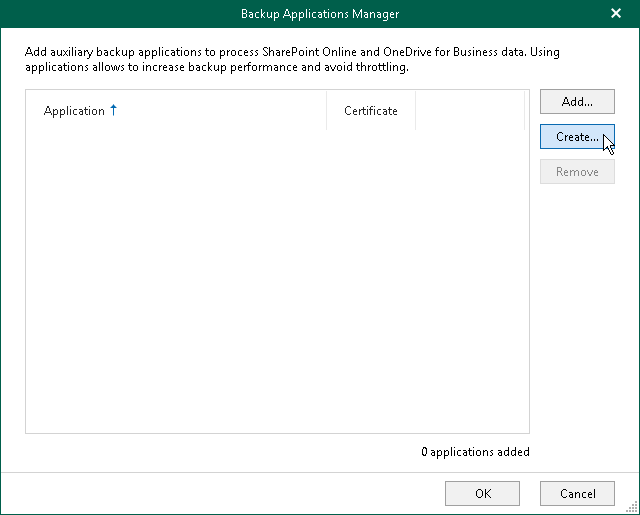
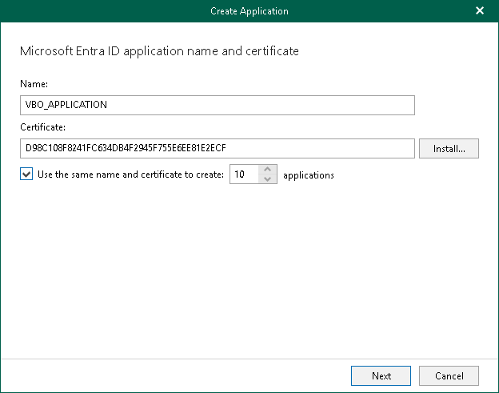
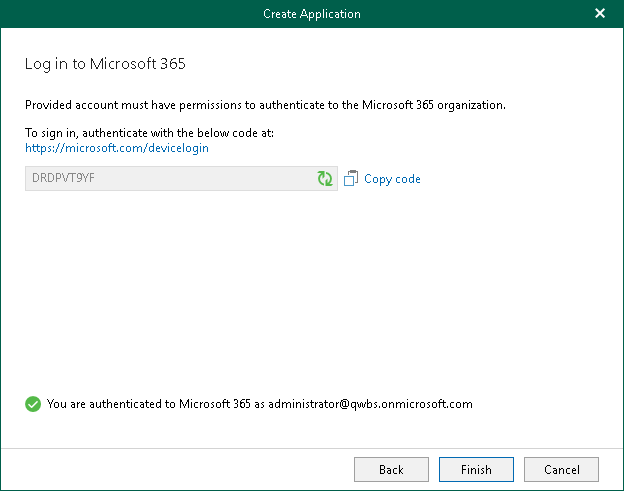

In this article

When you create a new Microsoft Entra application, Veeam Backup for Microsoft 365 automatically registers this application in Microsoft Entra ID of your Microsoft 365 organization. After you create an application, Veeam Backup for Microsoft 365 automatically adds this application to the backup configuration. For more information about Microsoft Entra applications, see [this Microsoft article](https://docs.microsoft.com/en-us/azure/active-directory/develop/active-directory-how-applications-are-added).

To create Microsoft Entra applications and add them to the backup configuration, do the following:

1. Open the Organizations view.
2. In the inventory pane, right-click a Microsoft 365 organization with modern app-only authentication and select Manage backup applications.

Keep in mind that the Manage backup applications option is available only for organizations added using modern app-only authentication. For organizations added using either basic authentication or modern authentication method with legacy protocols allowed, you use the Manage backup accounts option. For more information, see [Adding Accounts](adding_backup_accounts.md).

1. In the Backup Applications Manager window, click Create.

The Create Application wizard runs.

1. Enter a name that you want to use for the Microsoft Entra application.
2. Click Install to specify an SSL certificate for secure communications between Veeam Backup for Microsoft 365 and your backup application.
3. In the Select Certificate wizard, proceed to any of the following options:

* [Generate a new self-signed certificate](vbo_installing_certificate.md#generate_new)

* [Select certificate from the Certificate Store of this server](vbo_installing_certificate.md#selecting_file)
* [Import certificate from a PFX file](vbo_installing_certificate.md#import)

Veeam Backup for Microsoft 365 will automatically register the specified certificate in your Microsoft Entra ID and assign this certificate to the Microsoft Entra application. In addition, Veeam Backup for Microsoft 365 automatically grants the Sites.FullControl.All permission to the application.

1. If you want to create more than one Microsoft Entra application, select the Use the same name and certificate to create N applications check box and specify how many applications Veeam Backup for Microsoft 365 must create. Applications may have the same name, however, each application always has a unique identification number. You can create maximum 100 applications per wizard session. If you need to create more than 100 applications, you can click Create and repeat the steps.

1. Click Copy code to copy an authentication code.

Keep in mind that a code is valid for 15 minutes. You can click Refresh to request a new code from Microsoft.

1. Click the Microsoft Identity platform authentication server link.

A web browser window opens.

1. On the Sign in to your account webpage, paste the code that you have copied and sign in to Microsoft Identity platform.

Make sure to sign in with the user account that has the Global Administrator role. For more information about this role, see [this Microsoft article](https://docs.microsoft.com/en-us/azure/active-directory/users-groups-roles/directory-assign-admin-roles).

1. Return to the Create Application wizard and click Finish.

Page updated 2/14/2025

Page content applies to build 8.3.0.2201
