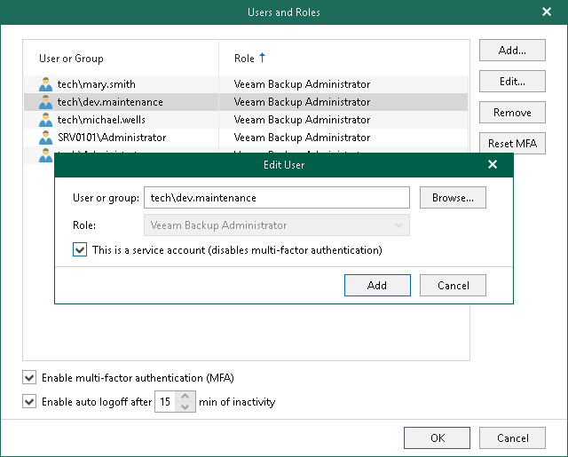

In this article

If you cannot use MFA due to limitations described in [Considerations and Limitations](mfa.md#considerations), you can disable this feature for specific service accounts used to run applications and backup infrastructure components.

To disable MFA for service accounts, do the following:

1. Log in to the Veeam Backup for Microsoft 365 console using the administrator credentials.
2. In the main menu, click Manage Users & Roles > Users and Roles.
3. In the Users and Roles window, select the service account and click Edit.
4. In the Edit User window, select the This is a service account (disables two-factor authentication) check box and click Add.
5. Click OK.

Page updated 7/18/2024

Page content applies to build 8.3.0.2201
