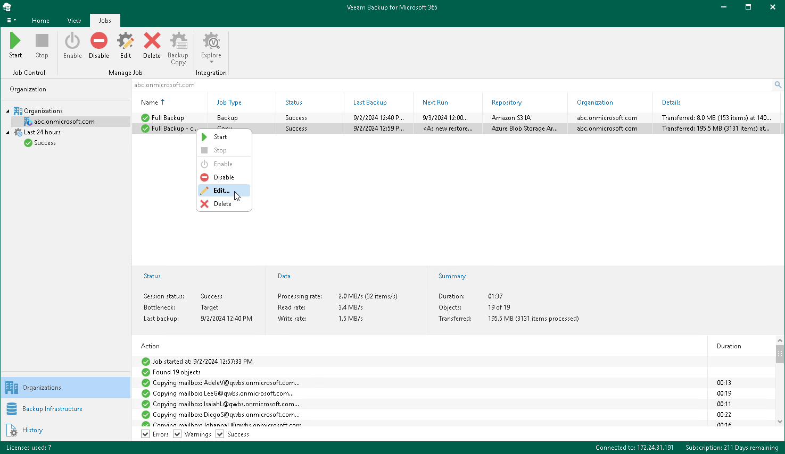

In this article

Veeam Backup for Microsoft 365 allows you to edit a backup copy job settings.

To edit settings of a backup copy job, do the following:

1. Open the Organizations view.
2. In the inventory pane, select an organization.

|  |
| --- |
| Tip |
| You can also select the root Organizations node to see all backup and backup copy jobs that were created for all organizations added to the scope. |

1. In the preview pane, do one of the following:

* Select a backup copy job and click Edit on the ribbon.
* Right-click a backup copy job and select Edit.

A backup copy job name consists of a backup job name for which a backup copy job is created and the copy job postfix.

1. Modify the required settings.

You can change a [target object storage repository](target_backup_copy_repo.md) and reconfigure a backup copy job scheduling options.

Related Topics

[Creating Backup Copy Job](vbo_new_copy_job.md)

Page updated 9/2/2024

Page content applies to build 8.3.0.2201
