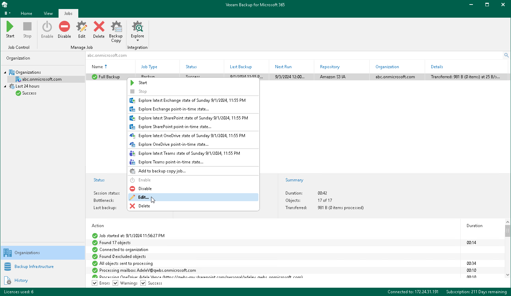

In this article

Veeam Backup for Microsoft 365 allows you to edit a backup job settings.

To edit settings of a backup job, do the following:

1. Open the Organizations view.
2. In the inventory pane, select an organization.

|  |
| --- |
| Tip |
| You can also select the root Organizations node to see all backup and backup copy jobs that were created for all organizations added to the scope. |

1. In the preview pane, do one of the following:

* Select a backup job and click Edit on the ribbon.

* Right-click a backup job and select Edit.

1. Modify the required settings.

You can change the following parameters:

* The backup job name and description.
* The list of objects to back up and their processing options.
* The list of objects to exclude and their exclusion options.
* You can select another object storage repository or JET-based backup repository.

|  |
| --- |
| Note |
| If a backup copy job is already created for the backup job that you edit, you cannot select another object storage repository of a different retention type. |

* You can reconfigure the backup job scheduling options.

Related Topics

[Creating Backup Job](vbo_new_backup_job.md)

Page updated 9/2/2024

Page content applies to build 8.3.0.2201
