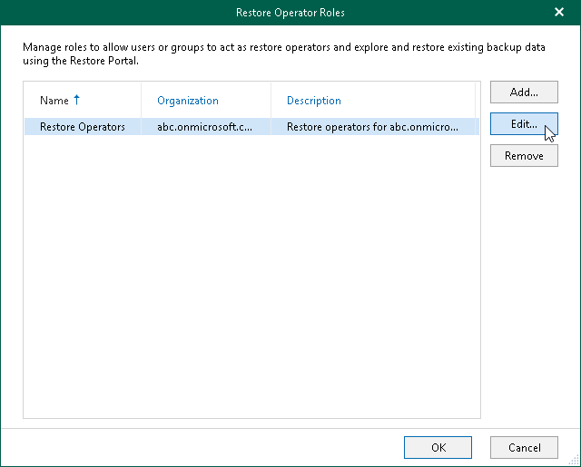

# Editing Restore Operator Role Settings

Veeam Backup for Microsoft 365 allows you to edit restore operator role settings.

To edit settings of a restore operator role, do the following:

1. In the main menu, click Manage Users & Roles > Restore Operator Roles.
2. In the Restore Operator Roles window, select a restore operator role and click Edit.
3. Modify the required settings.

You can change the following parameters:

* The name and description of a restore operator role.
* The list of restore operators.
* The lists of objects whose backed-up data the restore operators will and will not be able to explore and restore using Restore Portal.

Related Topics

[Adding Restore Operator Role](ssp_adding_operator_roles.md)

