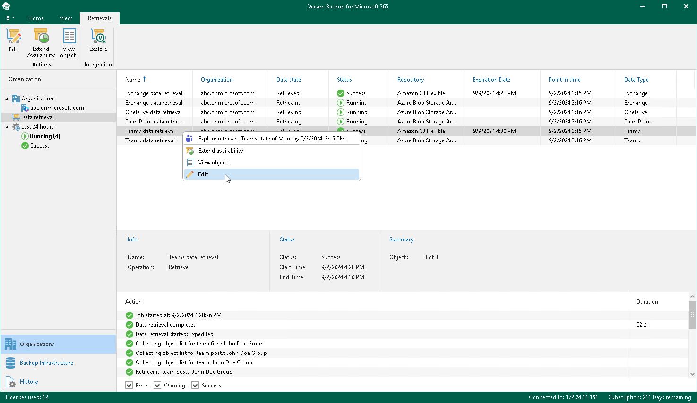

In this article

Veeam Backup for Microsoft 365 allows you to edit a retrieval job settings.

To edit settings of a retrieval job, do the following:

1. Open the Organizations view.
2. In the inventory pane, select the Data retrieval node.
3. In the preview pane, do one of the following:

* Select a retrieval job and click Edit on the ribbon.

* Right-click a retrieval job and select Edit.

1. Modify the required settings.

You can change the following parameters:

* The name and description of a retrieval job.
* The availability period of the retrieved backed-up data.

Related Topics

[Creating Retrieval Job](vbo_new_retrieval_job.md)

Page updated 9/2/2024

Page content applies to build 8.3.0.2201
