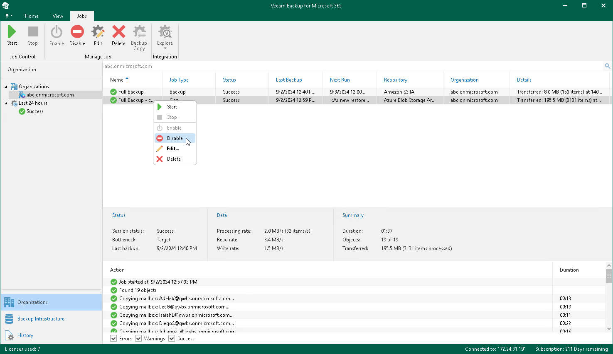

# Enabling or Disabling Backup Copy Job

You can enable or disable a backup copy job.

Consider the following:

* If a backup copy job is enabled, it can be executed on schedule.
* If a backup copy job is disabled, it cannot be executed on schedule but you can run it manually using the Start command. For more information, see [Starting Backup Copy Job](starting_backup_copy_job.md).

To enable or disable a backup copy job, do the following:

1. Open the Organizations view.
2. In the inventory pane, select an organization.

|  |
| --- |
| Tip |
| You can also select the root Organizations node to see all backup and backup copy jobs that were created for all organizations added to the scope. |

1. In the preview pane, do one of the following:

* Select a backup copy job and click Enable or Disable on the ribbon.
* Right-click a backup copy job and select Enable or Disable.

A backup copy job name consists of a backup job name for which a backup copy job is created and the copy job postfix.

