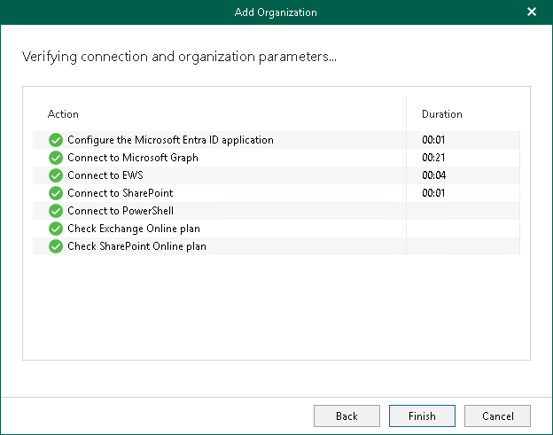

# Step 7. Finish Working with Wizard

At this step of the wizard, wait for a connection to be established and click Finish.

The Microsoft 365 organization appears under the Organizations node in the inventory pane.

