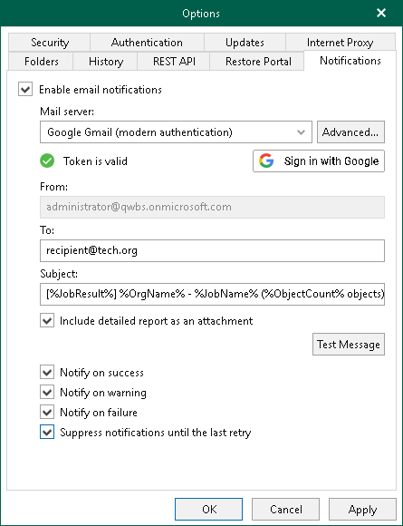

In this article

You can authorize Veeam Backup for Microsoft 365 to send email notifications on behalf of your Google account. To send notifications, Veeam Backup for Microsoft 365 communicates with the Gmail API. For authentication, Veeam Backup for Microsoft 365 uses an access token issued by Google Authorization Server. To acquire an access token, you can either use an application preinstalled by Veeam or specify OAuth 2.0 client credentials of the custom application registered in the Google Cloud console. For more information on obtaining client credentials, see [Registering Application in Google Cloud Console](register_app_google.md).

To configure sending email notifications on behalf of your Google account, do the following:

1. In the main menu, click General Options.
2. Open the Notifications tab.
3. Select the Enable email notifications check box.
4. From the Mail server drop-down list, select Google Gmail (modern authentication).
5. Do one of the following:

* To use an application preinstalled by Veeam, click Sign in with Google and enter credentials of your Google account to complete authentication.
* To use the custom application, click Advanced to specify [the advanced settings](#advanced), then click Sign in with Google and enter credentials of your Google account to complete authentication.

1. In the From field, review the email address to be shown as a sender.

|  |
| --- |
| Note |
| You can change the sender email address. To send email notifications on behalf of another Google account, click Sign in with Google and use another email address to sign in. |

1. In the To field, specify the email address of the notification recipient.

To specify multiple email addresses, use semicolon.

1. In the Subject field, edit a notification subject if needed.

By default, a notification subject is "[%JobResult%] %OrgName% - %JobName% (%ObjectCount% objects), %Issues% issues",

where:

* %JobResult%. A job result (Success, Warning, Failed).
* %OrgName%. A Microsoft 365 organization for which the job was configured.
* %JobName%. A job name.
* %ObjectCount%. Total number of processed objects.
* %Issues%. Number of objects with Failed or Warning statuses.
* %Time%. Date and time of a job completion.

1. Select the Include detailed report as an attachment check box if you want to include a detailed report as an email attachment.

If you select this option, Veeam Backup for Microsoft 365 will provide a summary about the job results in the notification body and a detailed report for each object processed by the job in the email attachment. Keep in mind that for jobs that process up to 1000 objects, Veeam Backup for Microsoft 365 always provides both a summary and a detailed report in the notification body.

1. By default, system notifications are sent every time a job session is completed with any of the following statuses: Success, Warning and Failure. To turn off unwanted notifications, clear check boxes next to the events for which you do not want to receive notifications:

* Notify on success

Veeam Backup for Microsoft 365 will send email notifications if a backup or backup copy job completes successfully without any warnings or errors.

* Notify on warning

Veeam Backup for Microsoft 365 will send email notifications if a backup or backup copy job completes with warnings.

* Notify on failure

Veeam Backup for Microsoft 365 will send email notifications if a backup or backup copy completes with errors.

1. If a backup or backup copy job is configured to perform retry attempts, select the Suppress notifications until the last retry check box to send email notifications according to the job schedule settings. The following email notification scenarios are possible:

* If the job fails, Veeam Backup for Microsoft 365 will send a notification message on the last job retry.
* If the job completes with Success or Warning, Veeam Backup for Microsoft 365 will send a notification message on the last completion status.
* If the job is scheduled to Terminate job if it exceeds allowed backup window, Veeam Backup for Microsoft 365 will send a notification message on the last attempt within the configured interval.

1. Click Test Message to send a test message.
2. Click OK.

Configuring Advanced Settings

In the Google Gmail Application Settings window, select the Use custom application registration settings check box and specify the following:

1. In the Application client ID field, specify specify the obtained client ID.
2. In the Client secret field, specify the client secret.

Page updated 9/11/2025

Page content applies to build 8.3.0.2201
