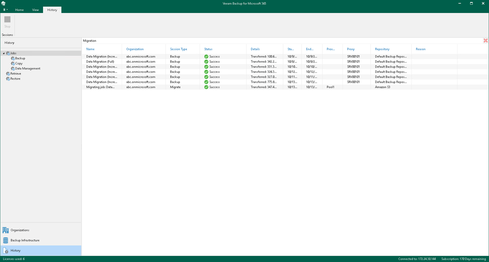

# Performing Search

In the History view of the Veeam Backup for Microsoft 365 console, you can search for backup, backup copy, retrieve, restore and data management sessions using keywords.

To search for backup, backup copy, retrieve, restore and data management sessions, do the following:

1. Open the History view.
2. Select one of the following nodes:

* Jobs. To search for all backup, backup copy and data management sessions.

* Backup. To search only for backup sessions.

* Copy. To search only for backup copy sessions.
* Data Management. To search only for data management sessions.

* Retrieve. To search for retrieve sessions.
* Restore. To search for restore sessions.

1. Enter a search query in the search field at the top of the preview pane.

Veeam Backup for Microsoft 365 will display only sessions whose names include keywords that you are searching for.

To remove a keyword, click the cross mark.

