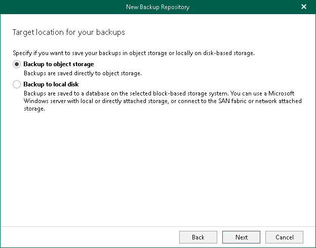

In this article

At this step of the wizard, select Backup to object storage to back up your data directly to the supported cloud or on-premises storage system.

Page updated 7/18/2024

Page content applies to build 8.3.0.2201
