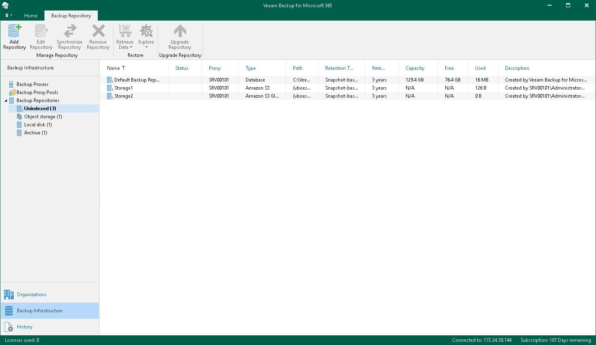

In this article

Indexing is the automatic process when a backup proxy server collects and sends the restore points metadata of a backup repository associated with this backup proxy server to the Veeam Backup for Microsoft 365 controller. This information is accumulated in the Veeam Backup for Microsoft 365 configuration database created on the PostgreSQL instance. Veeam Backup for Microsoft 365 performs indexing after you re-attach a backup repository to the same or another Veeam Backup for Microsoft 365 server or after upgrading Veeam Backup for Microsoft 365 to a newer version.

Veeam Backup for Microsoft 365 put a backup repository into the Unindexed state until indexing finishes. Such backup repositories can be found in the Backup Infrastructure view under the Backup Repositories > Unindexed node.

You can create and start an indexing session manually. To do this, run the [Start-VBORepositoryIndexingSession](https://helpcenter.veeam.com/docs/vbo365/powershell/start-vborepositoryindexingsession.html?ver=80) cmdlet.

Page updated 8/13/2025

Page content applies to build 8.3.0.2201
