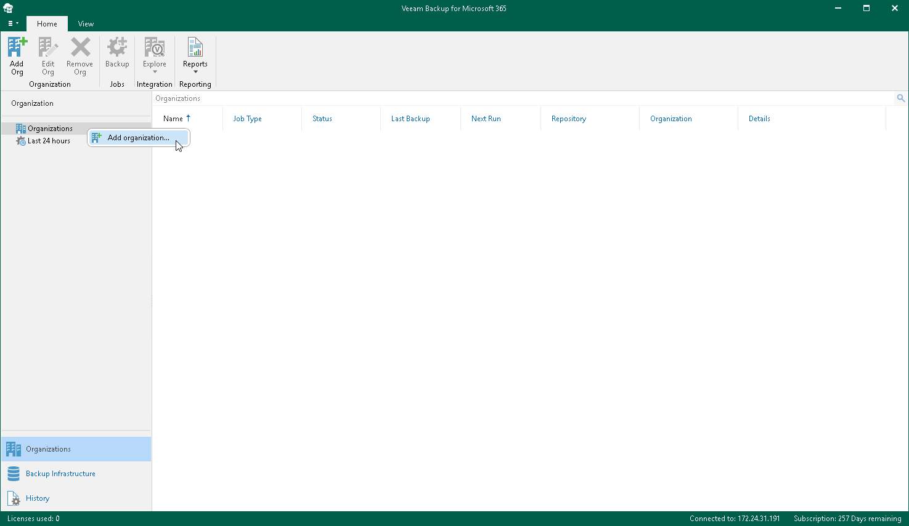

In this article

To launch the Add Organization wizard, do the following:

1. Open the Organizations view.
2. Do one of the following:

* On the Home tab, click Add Org on the ribbon.
* In the inventory pane, right-click the Organizations node and select Add organization.

Page updated 7/18/2024

Page content applies to build 8.3.0.2201
