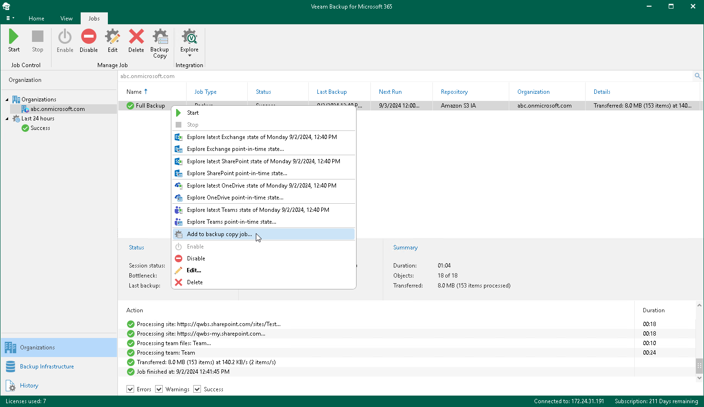

In this article

|  |
| --- |
| Note |
| Backup copy capabilities are only available if you have specified an object storage repository as a target for your backup jobs. For more information, see [Specify Backup Repository](specify_backup_proxy_server.md). |

To launch the New Backup Copy Job wizard, do the following:

1. Open the Organizations view.
2. In the inventory pane, select an organization.

|  |
| --- |
| Tip |
| You can also select the root Organizations node to see all backup and backup copy jobs that were created for all organizations added to the scope. |

1. In the preview pane, do one of the following:

* Select a backup job for which you want to create a backup copy job and click Backup Copy on the ribbon.
* Right-click a backup job and select Add to backup copy job.

Keep in mind that you can create only one backup copy job per backup job.

Page updated 9/2/2024

Page content applies to build 8.3.0.2201
