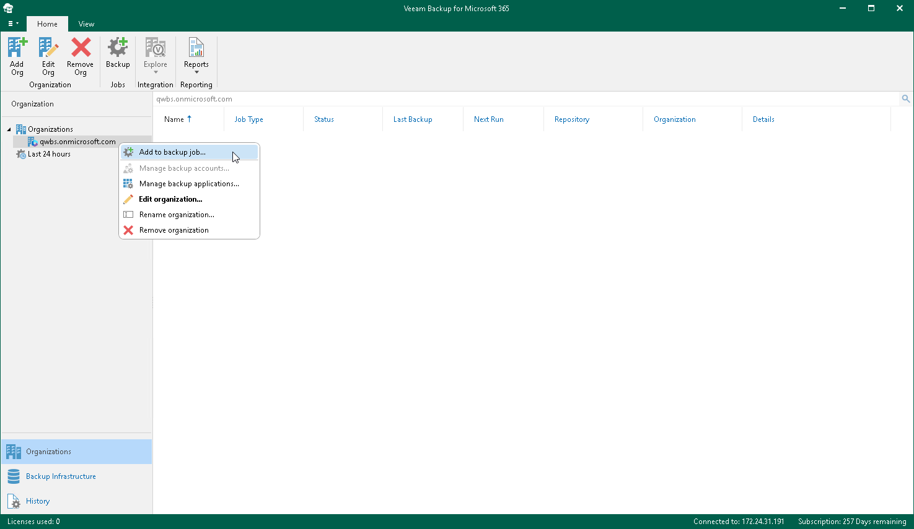

# Step 1. Launch New Backup Job Wizard

To launch the New Backup Job wizard, do the following:

1. Open the Organizations view.
2. In the inventory pane, select an organization for which you want to create a backup job.
3. Do one of the following:

* On the Home tab, click Backup on the ribbon.
* Right-click an organization and select Add to backup job.

