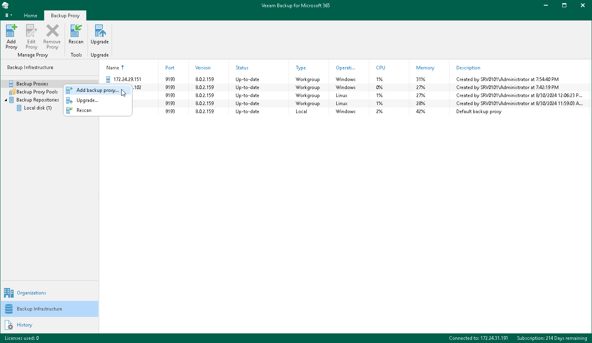

In this article

To launch the New Backup Proxy wizard, do the following:

1. Open the Backup Infrastructure view.
2. In the inventory pane, select the Backup Proxies node.
3. Do one of the following:

* On the Backup Proxy tab, click Add Proxy on the ribbon.
* Right-click the Backup Proxies node and select Add backup proxy.

Page updated 8/30/2024

Page content applies to build 8.3.0.2201
