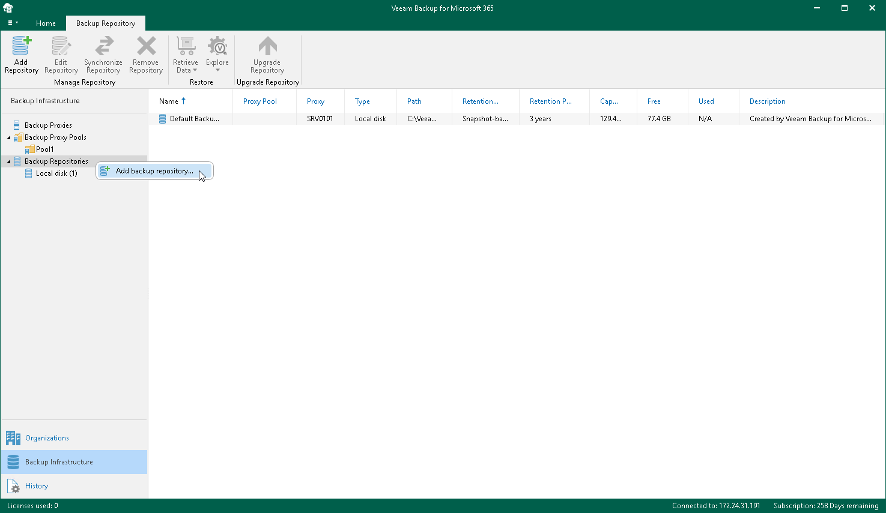

In this article

To launch the New Backup Repository wizard, do the following:

1. Open the Backup Infrastructure view.
2. In the inventory pane, select the Backup Repositories node.
3. Do one of the following:

* On the Backup Repository tab, click Add Repository on the ribbon.
* Right-click the Backup Repositories node and select Add backup repository.

Page updated 7/17/2024

Page content applies to build 8.3.0.2201
