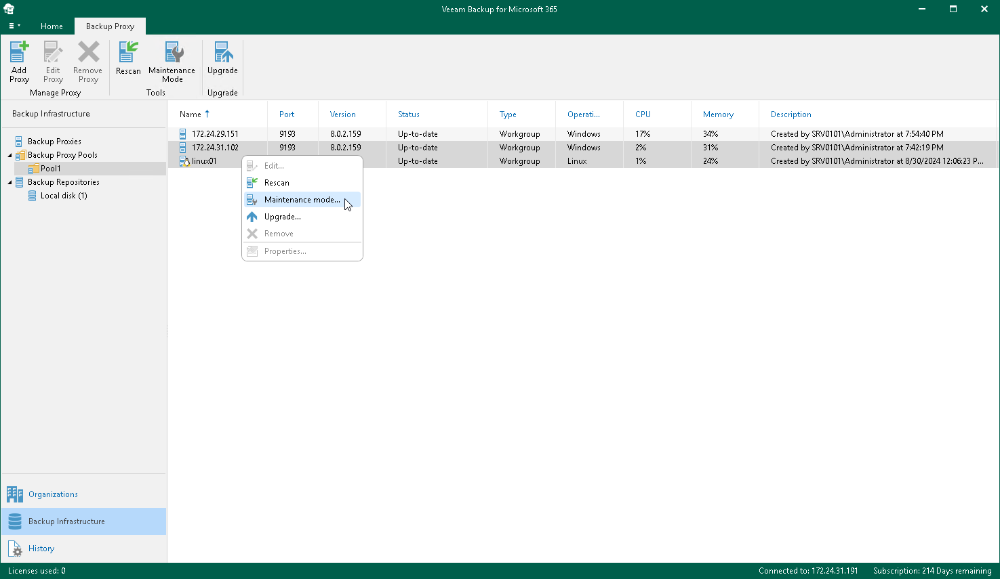

In this article

To launch the Proxy Maintenance wizard, do the following:

1. Open the Backup Infrastructure view.
2. In the inventory pane, select a backup proxy pool containing a backup proxy server which you want to put under maintenance.
3. In the preview pane, do one of the following:

* Select a backup proxy server and click Maintenance Mode on the ribbon.

* Right-click a backup proxy server and select Maintenance mode.

If you want to enable the maintenance mode for multiple backup proxy servers, select necessary backup proxy servers in the preview pane, right-click the selection and select Maintenance mode.

|  |
| --- |
| Note |
| Do not put under maintenance all backup proxy servers in the backup proxy pool. Veeam Backup for Microsoft 365 requires to keep active at least one backup proxy server per backup proxy pool. |

Page updated 8/30/2024

Page content applies to build 8.3.0.2201
