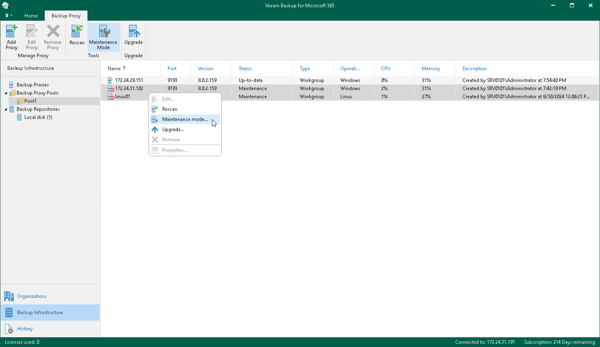

In this article

To launch the Proxy Maintenance wizard, do the following:

1. Open the Backup Infrastructure view.
2. In the inventory pane, select a backup proxy pool containing a backup proxy server which you want to return from maintenance.
3. In the preview pane, do one of the following:

* Select a backup proxy server and click Maintenance Mode on the ribbon.

* Right-click a backup proxy server and select Maintenance mode.

If you want to disable the maintenance mode for multiple backup proxy servers, select necessary backup proxy servers in the preview pane, right-click the selection and select Maintenance mode.

Page updated 8/30/2024

Page content applies to build 8.3.0.2201
