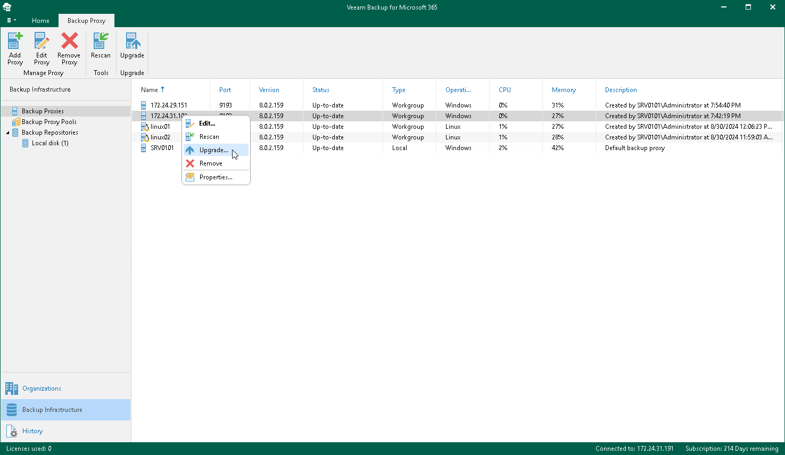

In this article

To launch the Proxy Upgrade wizard, do the following:

1. Open the Backup Infrastructure view.
2. In the inventory pane, select the Backup Proxies node.
3. In the preview pane, do one of the following:

* Select a backup proxy server and click Upgrade on the ribbon.

* Right-click a backup proxy server and select Upgrade.

If you want to upgrade all backup proxy servers at the same time, right-click the Backup Proxies node and click Upgrade.

Page updated 8/30/2024

Page content applies to build 8.3.0.2201
