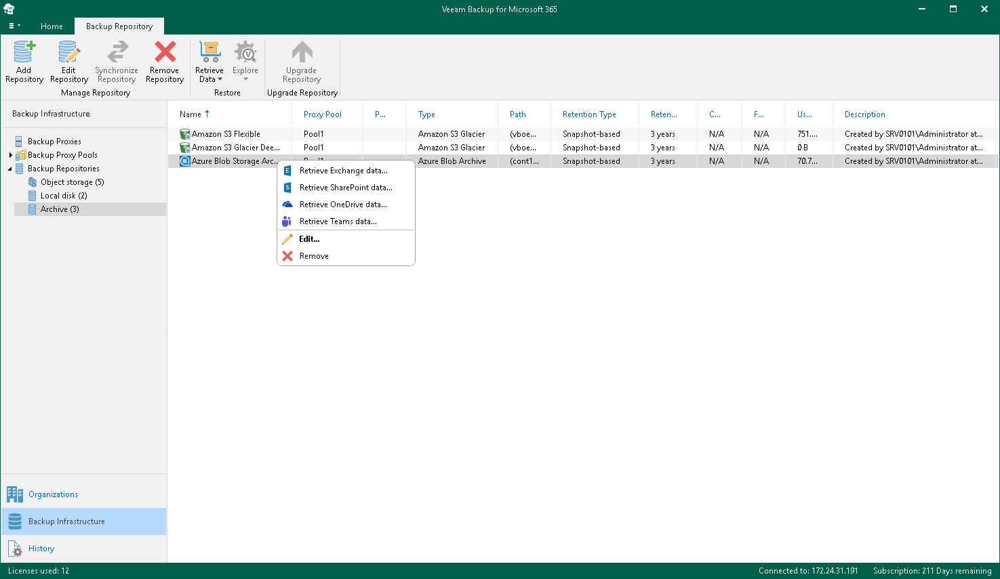

In this article

To launch the Retrieve Backup Copy wizard, do the following:

1. Open the Backup Infrastructure view.
2. In the inventory pane, select the Backup Repositories or Backup Repositories > Archive node.
3. In the preview pane, do one of the following:

* Select an object storage repository from which you want to retrieve backed-up data and click Retrieve Data on the ribbon and then select Retrieve <product> data.

* Right-click an object storage repository from which you want to retrieve backed-up data and select Retrieve <product> data.

|  |
| --- |
| Note |
| The Retrieve <product> data option is one of the following:   * Retrieve Exchange data. Use this option to create a retrieval job for the subsequent explore and restore of the retrieved data using Veeam Explorer for Microsoft Exchange. * Retrieve SharePoint data. Use this option to create a retrieval job for the subsequent explore and restore of the retrieved data using Veeam Explorer for Microsoft SharePoint. * Retrieve OneDrive data. Use this option to create a retrieval job for the subsequent explore and restore of the retrieved data using Veeam Explorer for Microsoft OneDrive for Business. * Retrieve Teams data. Use this option to create a retrieval job for the subsequent explore and restore of the retrieved data using Veeam Explorer for Microsoft Teams. |

Page updated 9/2/2024

Page content applies to build 8.3.0.2201
