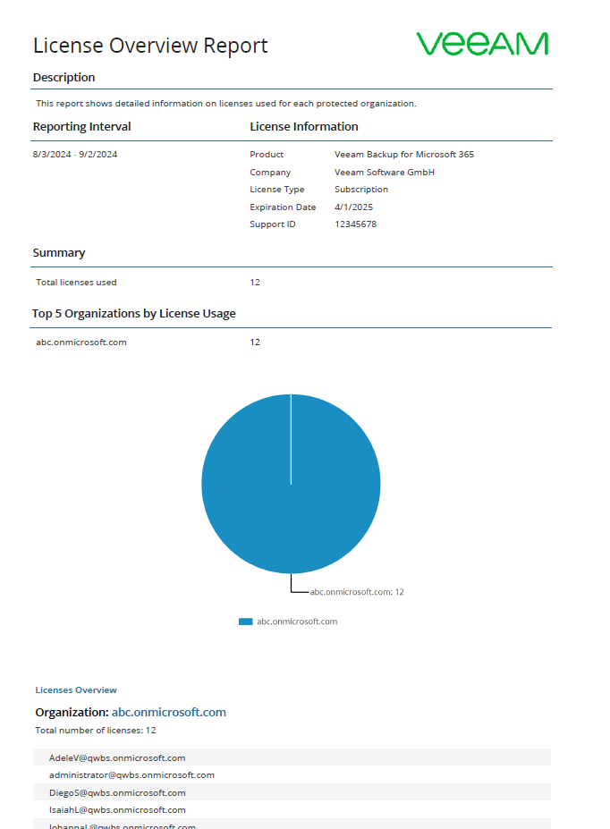
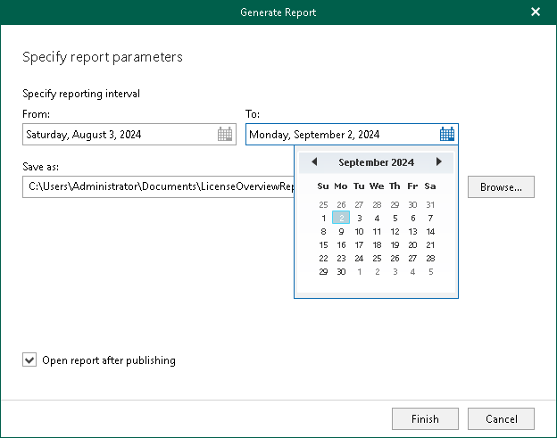

In this article

The License Overview reports show statistical information on how many licenses are in use and by which organization.

Each report consists of the following fields and shows information per organization consuming the license.

| Field | Description |
| --- | --- |
| Description | Shows a description of the report. |
| Reporting Interval | Shows the time interval for which the report is generated.  Note: By default, the report is generated for 30 days. If the reporting interval that you set is more than 1 day, the report includes all organizations that consumed the license within the specified period. Even if an organization license expired within the specified period, such organization is included in the report as well. |
| License Information | Shows the following:   * Product name * Company name * License type * License expiration date * Support identification number |
| Summary | Shows how many licenses are in use, including licenses for user accounts whose status is [new user](vbo_rental_license.md#trial). |
| Top 5 Organizations by License Usage | Shows top 5 organizations that consume the license the most. |

|  |
| --- |
| Note |
| When using a rental license, the License Overview report also shows a number of new user accounts per each organization. For more information, see [Rental License](vbo_rental_license.md). |

To generate a report, do the following:

1. Open the Organizations view.
2. In the inventory pane, select an organization.
3. On the Home tab, click Reports > License Overview.

The Generate Report wizard runs.

1. Specify a time interval for reporting.
2. Click Browse to specify a location to save the report.

Use the Save as type drop-down list in the Save As dialog to select PDF or CSV format in which you want to save the report.

1. Select the Open report after publishing check box to open the generated report using the default application.
2. Click Finish.

Page updated 9/17/2024

Page content applies to build 8.3.0.2201
