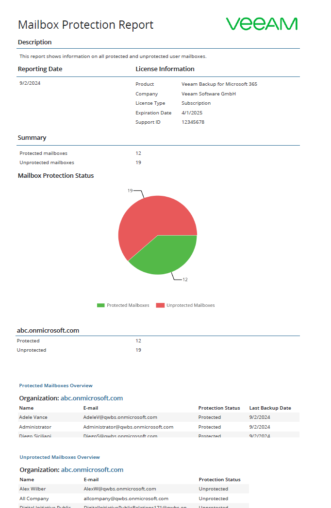
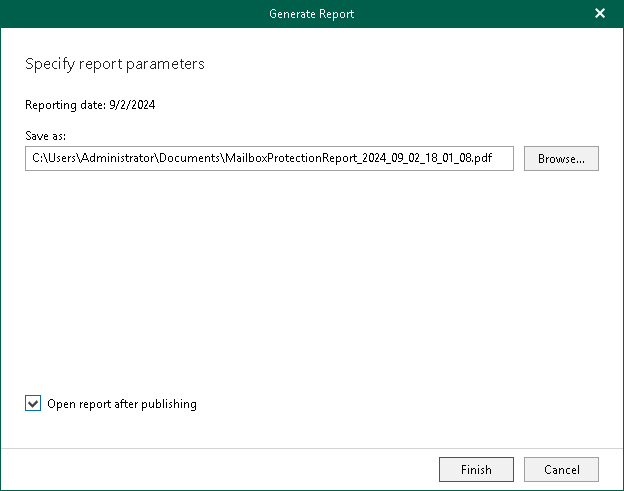

In this article

The Mailbox Protection reports show statistical information on protected and unprotected mailboxes of your Microsoft 365 and on-premises Microsoft Exchange organizations.

Each report consists of the following fields and shows information per mailbox.

| Field | Description |
| --- | --- |
| Description | Shows a description of the report. |
| Reporting Date | Shows the date when the report was created. |
| License Information | Shows the following:   * Product name * Company name * License type * License expiration date * Support identification number |
| Summary | Shows the total number of protected and unprotected mailboxes per each organization added to the scope:   * A mailbox is considered protected if it was backed up at least once within the last 31 days. * A mailbox is considered unprotected if it was not backed up at least once within the last 31 days, or if it was not backed up at all.   The following types of mailboxes are included in the report:   * Group mailbox * Public mailbox * Shared mailbox * Resource (Equipment and Room) mailbox |

To generate a report, do the following:

1. Open the Organizations view.
2. In the inventory pane, select an organization for which you want to create a report.

|  |
| --- |
| Tip |
| You can also select the root Organizations node to generate a report for all organizations added to the scope. |

1. On the Home tab, click Reports > Mailbox Protection.

The Generate Report wizard runs.

1. Click Browse to specify a location to save the report.

Use the Save as type drop-down list in the Save As dialog to select PDF or CSV format in which you want to save the report.

1. Select the Open report after publishing check box to open the generated report using the default application.
2. Click Finish.

Page updated 9/17/2024

Page content applies to build 8.3.0.2201
