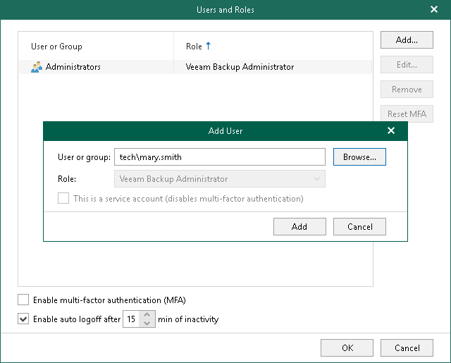

# Managing Users and Roles

You can manage a list of users and user groups that have permissions to access the Veeam Backup for Microsoft 365 console and Veeam Explorers. The Veeam Backup Administrator role will be assigned to such users and user groups allowing them to perform all administrative activities in Veeam Backup for Microsoft 365. Keep in mind that Veeam Backup Administrator has full access (the Full Access right) to all files on servers and machines added to the backup infrastructure.

|  |
| --- |
| Note |
| In Veeam Backup for Microsoft 365 version 8, only the Veeam Backup Administrator role is available. |

Consider the following:

* Built-in administrator accounts (Domain\Administrator and Machine\Administrator) always have full access to Veeam Backup for Microsoft 365, even if you exclude them from the Veeam Backup Administrator role. If you delete the Administrators group from the Veeam Backup Administrator role, the users who are added to this group will still have access to Veeam Backup for Microsoft 365.

|  |
| --- |
| Note |
| To protect administrator accounts from being compromised, it is strongly recommended to enable multi-factor authentication (MFA). In that case, even users with administrator privileges must pass the additional verification. For more information, see [Multi-Factor Authentication](mfa.md). |

* The user account under which the Veeam Backup for Microsoft 365 Service runs must have the Veeam Backup Administrator role. By default, during installation the Veeam Backup Administrator role is assigned to members of the local Administrators group.

|  |
| --- |
| Note |
| If you enable multi-factor authentication (MFA), note that Veeam Backup for Microsoft 365 services must run under the service account with disabled MFA. For more information, see [Disabling MFA for Service Accounts](disable_mfa_service_accounts.md). |

Adding Users or Groups

To add a user or a user group, do the following:

1. In the main menu, click Manage Users & Roles > Users and Roles.
2. In the Users and Roles window, click Add.
3. In the Add User window, do the following:

1. In the User or group field, enter a name of a user or user group in the domain\account format or click Browse to select an account in Windows Active Directory.
2. Click Add.

To use additional user verification, you can enable multi-factor authentication (MFA). For more information, see [Multi-Factor Authentication](mfa.md).

Removing Users or Groups

To remove a user or a user group from the list, do the following:

1. In the main menu, click Manage Users & Roles > Users and Roles.
2. In the Users and Roles window, select an account from which you want to revoke permissions to access the Veeam Backup for Microsoft 365 console and Veeam Explorers and click Remove. You can select multiple accounts at the same time.
3. Confirm the action.

Configuring Idle Timeout

To reduce the number of user sessions opened for a long time, you can set the idle timeout to automatically log off users. To do this, select the Enable auto logoff after <N> min of inactivity check box and set the number of minutes.

