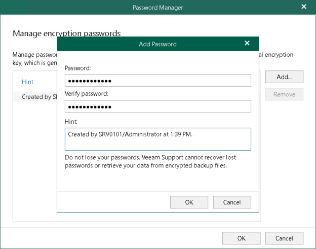

In this article

Veeam Backup for Microsoft 365 allows you to configure passwords that you can use to encrypt data in object storage using the 256-bit Advanced Encryption Standard (AES). For more information, see [Data Encryption](data_encryption.md).

Consider the following recommendations when you create an encryption password:

* Use strong passwords that are hard to crack or guess:

* The password must be at least 8 characters long.
* The password must contain uppercase and lowercase characters.
* The password must be a mixture of alphabetic, numeric and punctuation characters.
* The password must significantly differ from the password you used previously.
* The password must not contain any real information related to you, for example, date of birth, your pet’s name, your logon name and so on.

* Provide a meaningful hint for the password that will help you recall the password.
* Keep your passwords in the safe place.
* If encryption has been enabled, change passwords for object storage repositories regularly. Use of different passwords helps increase the encryption security level. For more information, see [Data Encryption](data_encryption.md).

To add an encryption password, do the following:

1. In the main menu, click Credentials & Passwords > Manage Passwords.
2. In the Password Manager window, click Add.
3. In the Password field, enter a new password.
4. In the Verify password field, re-enter the password.
5. In the Hint field, enter a hint that will help you to recall the password.

|  |
| --- |
| Important |
| Make sure to remember your encryption password because, if lost, it cannot be restored. Editing of already created encryption passwords is not supported. |

In This Section

[Removing Encryption Passwords](edit_remove_password.md)

Page updated 10/13/2025

Page content applies to build 8.3.0.2201
