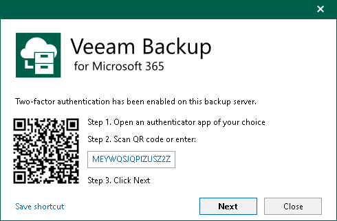
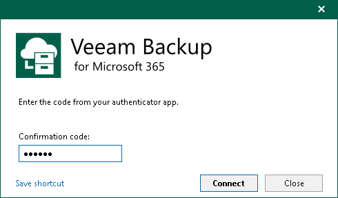

# Multi-Factor Authentication

Veeam Backup for Microsoft 365 supports multi-factor authentication (MFA) for additional user verification. A one-time password (OTP) generated in the mobile authenticator application is used as a second verification method. Combined with authentication credentials, it creates a more secure environment and protects user accounts from being compromised.

You can do the following:

* [Enable and disable MFA for all users](mfa_enable_disable_all.md).
* [Disable MFA for service accounts](disable_mfa_service_accounts.md).
* [Reset MFA for specific users](reset_mfa.md).

Considerations and Limitations

Consider the following:

* Only users with the Veeam Backup Administrator role can manage MFA.
* MFA is not supported in the Community Edition mode.
* User groups are not supported. You can enable MFA only for user accounts.
* MFA is not supported for non-interactive connections used by the following applications and backup infrastructure components:

* Veeam Backup for Microsoft 365 REST API
* Veeam ONE agent (for communication with the Veeam Backup for Microsoft 365 server)
* Veeam Service Provider Console

To avoid connection issues, you must disable MFA for the accounts used to run these applications and backup infrastructure components. For more information, see [Disabling MFA for Service Accounts](disable_mfa_service_accounts.md).

* MFA is not supported for PowerShell (either interactive logon or non-interactive connections). To use PowerShell cmdlets with Veeam.Archiver.PowerShell module or Windows PowerShell, run the Veeam Backup for Microsoft 365 console or Microsoft Windows PowerShell under the service account with disabled MFA.
* If a service provider uses Veeam Service Provider Console and wants to use multi-factor authentication for the Veeam Backup for Microsoft 365 server on the service provider side, they must set up a service account in Veeam Backup for Microsoft 365.
* Mobile push notifications are not supported. You can get an OTP code only in the mobile authenticator application.

How MFA Works

Veeam Backup for Microsoft 365 offers the following scenario for MFA:

1. A user logs in to the Veeam Backup for Microsoft 365 console. For more information, see [Launching Veeam Backup for Microsoft 365](vbo_application_launch.md).
2. Veeam Backup for Microsoft 365 checks if MFA is enabled and configured for the user:

* If MFA is enabled but not configured for the user:

The user gets the instruction how to set up MFA. Veeam Backup for Microsoft 365 generates a secret key which is used once for the initial setup in the mobile authenticator application. The hash of the secret key is also saved in the configuration database.

* If MFA is enabled and configured for the user:

Each time the user logs in they should enter a 6-digit confirmation code generated in the mobile authenticator application. Veeam Backup for Microsoft 365 checks if the code is valid and, in case of success, starts a user session.

If there are more than 5 unsuccessful attempts, the user can reopen the console and try to log in again after waiting for at least one minute. If the problem persists, the Veeam Backup for Microsoft 365 administrator can reset MFA by request. For more information, see [Resetting MFA for Specific User](reset_mfa.md).

|  |
| --- |
| Important |
| The code confirmation works when there is no time shifting between the mobile authenticator application and the Veeam Backup for Microsoft 365 server. Ensure that they are synchronized with the UTC time. Otherwise, the authentication will fail. |

If Veeam Explorers are started from the Veeam Backup for Microsoft 365 console, they do not require additional authentication.

