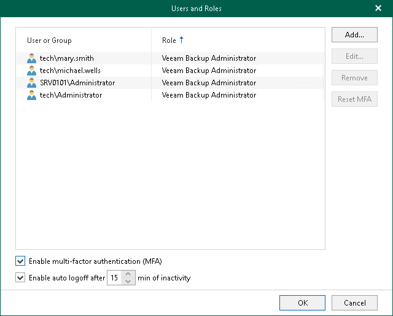

# Enabling and Disabling MFA for All Users

You can enable and disable MFA for all users.

|  |
| --- |
| Note |
| MFA is not supported for user groups. You must remove user groups from the list before enabling MFA. |

Enabling MFA

To enable MFA for all users, do the following:

1. Log in to the Veeam Backup for Microsoft 365 console using the administrator credentials.
2. In the main menu, click Manage Users & Roles > Users and Roles.
3. In the Users and Roles window, select the Enable multi-factor authentication (MFA) check box.
4. Click OK.

Disabling MFA

To disable MFA for all users, do the following:

1. Log in to the Veeam Backup for Microsoft 365 console using the administrator credentials.
2. In the main menu, click Manage Users & Roles > Users and Roles.
3. In the Users and Roles window, clear the Enable multi-factor authentication (MFA) check box.
4. Click OK.

