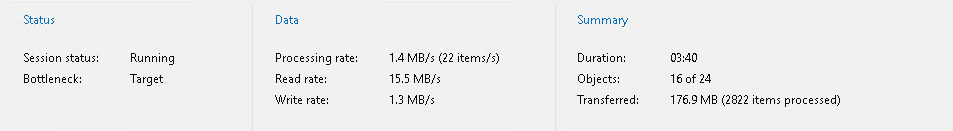

In this article

Data management sessions include sessions that you run to move or remove backed-up data using the [Move-VBOEntityData](https://helpcenter.veeam.com/docs/vbo365/powershell/move-vboentitydata.html?ver=80) or [Remove-VBOEntityData](https://helpcenter.veeam.com/docs/vbo365/powershell/remove-vboentitydata.html?ver=80) cmdlets.

To view a data management session metrics, do the following:

1. Open the History view.
2. In the inventory pane, select the Jobs > Data Management node.
3. In the preview pane, select a data management session.

Metrics of a data management session consist of the following sections:

* The Status section that shows the following fields:

* Session status. The current state of the selected session.
* Bottleneck. A bottleneck value.

This value may be: Detecting, Source, Target and N/A.

* The Detecting state is displayed when a data management job is started and Veeam Backup for Microsoft 365 has not calculated the bottleneck value.

* The Source state is displayed when a bottleneck occurs during download.

For example, if you are using a hard drive that is fragmented or an old type of the hard drive, the bottleneck value will typically be shown as Source.

* The Target state is displayed when a bottleneck occurs during writing data to disk.

For example, if you have a slow connection or problems occur on the internet provider side and your connection speed drops significantly, the bottleneck value will typically be shown as Target.

* The N/A state is displayed when no bottleneck occurs.

* The Data section that shows the following fields:

* Processing rate. Shows the processing rate.
* Read rate. Shows the download speed.
* Write rate. Shows the writing speed.

* The Summary section that shows the following fields:

* Duration. The duration of the data management session.
* Objects. Shows how many objects have been migrated during the session.

An object is an OneDrive account, SharePoint site, Microsoft Teams team, mailbox and archive mailbox, including group mailboxes, public folders and discovery search mailboxes.

* Transferred. Shows an amount of data transferred from source to target before applying compression and deduplication.

Page updated 10/21/2025

Page content applies to build 8.3.0.2201
